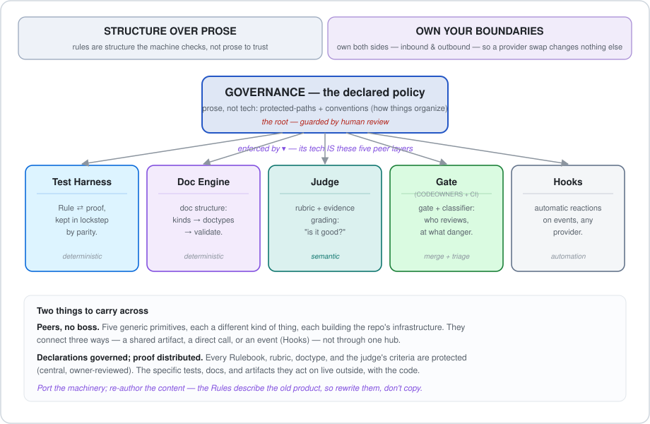
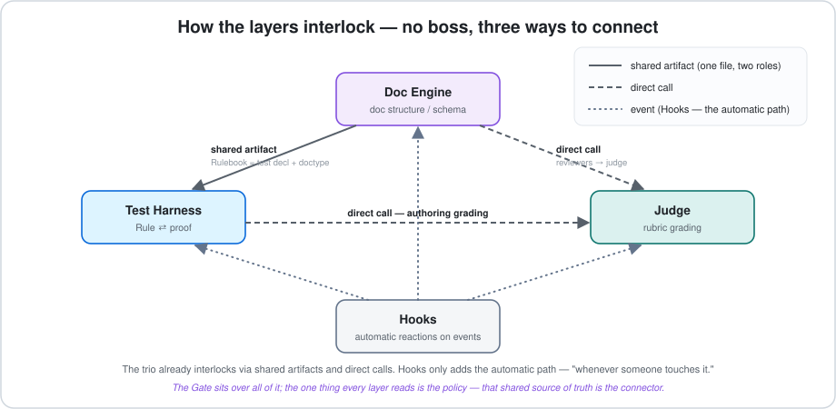
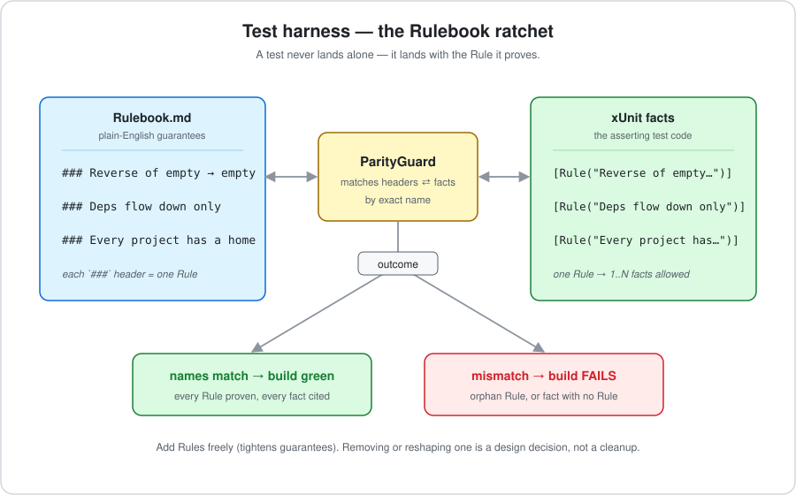
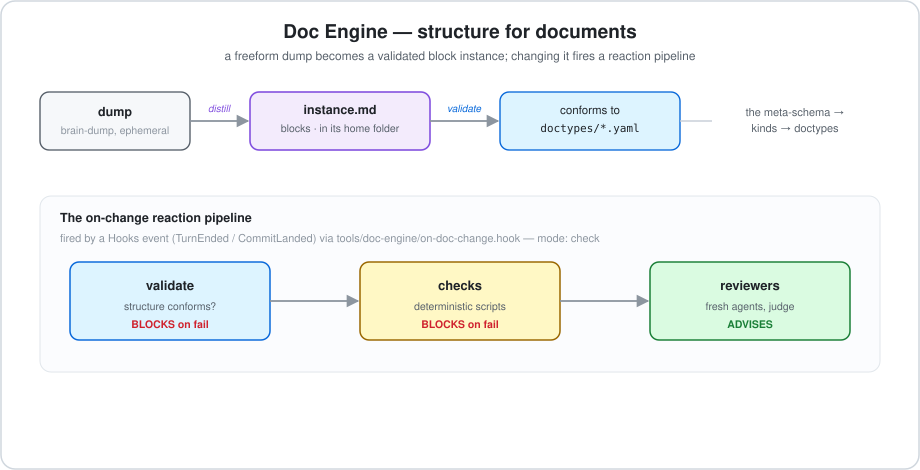
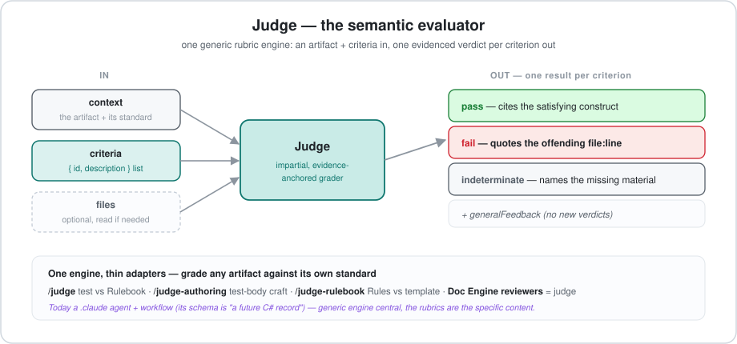
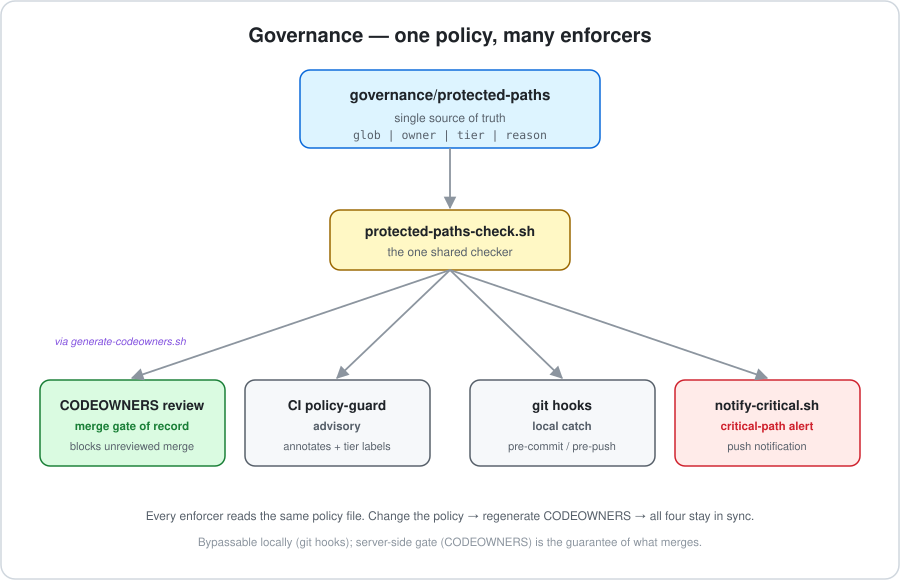
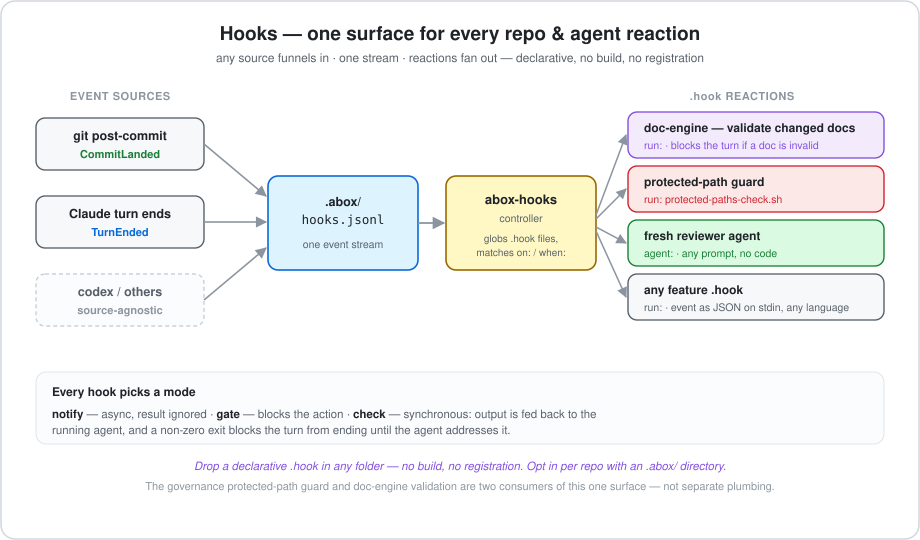
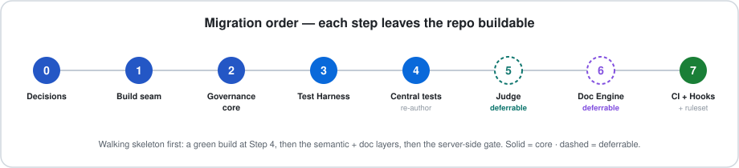

# Migrating Governance to a New Repo

> A cold-readable guide for lifting **governance** — and the five peer primitives it
> declares (Test Harness · Doc Engine · Judge · CODEOWNERS/CI · Hooks) — out of
> `abox-server` into a repository built from scratch.

**Before you start.** No prior `abox-server` knowledge is assumed. Two porting rules frame everything:

- **Port the machinery, re-author the content.** The engines travel cleanly; the *rules
  they enforce* (your architecture, folder names, doctypes, rubrics) describe the old
  product — rewrite them, don't copy. This is what keeps it a rebuild.
- **Keep load-bearing enforcers zero-dependency.** Per [ADR 0012](#source-adrs), every guard
  in the control surface is POSIX shell with no libraries, so it behaves identically on a dev
  box, in CI, and in an agent hook. Don't "tidy" a shell guard with a dependency.

## The two principles (the frame)

The whole system is a consequence of two ideas. They're the **why**; everything else is the **what**.

> **1 · Structure over prose.** Rules are *structure the machine checks*, not prose humans
> (or agents) are trusted to follow. A guarantee encoded as a project reference, a parity
> check, or a schema fires in the build itself and is **tamper-evident** — evading it is a
> visible diff a reviewer can gate.

> **2 · Own the interface.** In an era where models and harnesses turn over every few months,
> the durable asset is the *workflow* — the business logic — not provider-coupled glue.
> Governance owns the seam so providers (Claude, Codex, the next thing) stay **swappable** and
> reactions live **with the code that needs them**, not scattered in a vendor's magic folder.

Under those two principles, the structure is one picture:

---

## Table of contents

- [Part 1 — The model](#part-1--the-model)
  - [Governance: the policy root (not tech)](#governance-the-policy-root-not-tech)
  - [The five peer primitives, and how they interlock](#the-five-peer-primitives-and-how-they-interlock)
  - [1 · Test Harness](#1--test-harness) · [2 · Doc Engine](#2--doc-engine) · [3 · Judge](#3--judge) · [4 · CODEOWNERS / CI](#4--codeowners--ci) · [5 · Hooks](#5--hooks)
- [Part 2 — The migration](#part-2--the-migration)
  - [0 — Decisions](#step-0--decisions) · [1 — Build seam](#step-1--build--test-seam) · [2 — Governance core](#step-2--governance-core) · [3 — Test Harness](#step-3--test-harness) · [4 — Central tests](#step-4--central-tests-re-author) · [5 — Judge](#step-5--judge) · [6 — Doc Engine](#step-6--doc-engine) · [7 — CI + Hooks + ruleset](#step-7--codeowners--ci--hooks--the-github-ruleset)
- [Reference](#reference) — [A · Verification](#appendix-a--verification-checklist) · [B · Rename & config](#appendix-b--rename--config-reference) · [C · File inventory](#appendix-c--file-inventory) · [Source ADRs](#source-adrs)

---

# Part 1 — The model

## Governance: the policy root (not tech)

Here's the twist worth getting right: **governance itself is not a tool — it's the declared
policy.** Every layer below is tech that *enforces*; governance is the thing being enforced.
Its substance is **prose**:

- `protected-paths` — a hand-authored `glob | owner | tier | reason` list. Not derived from
  anything; *stated*. (Note the columns: `owner` = **routing**, `tier` = **danger level** — used below.)
- the conventions — "home folders", "where a Rulebook lives", "declarations central / proof
  co-located" — documentation (`CLAUDE.md`, the READMEs) that says how things organize.

The only "tech" governance owns is the **thin policy-reader** (`protected-paths-check.sh` + the
CODEOWNERS generator). Everything that *acts* is a layer — so governance ≈ no tech; **its tech is
the five layers.**

**Why it must be prose.** Everything else is structure-over-prose because there's a layer
*beneath* it enforcing it. Governance is the bottom turtle — nothing is beneath it, so it has to
be *stated*, and it's kept honest by the one non-machine backstop: **human review** (CODEOWNERS +
the identity split). The prose kernel is held by a person, deliberately.

| | What it is | Kept honest by |
|---|---|---|
| **Governance** | the declared policy + conventions (**prose**) | a human — CODEOWNERS review (the root backstop) |
| **The five layers** | tech that makes the policy true | each other + the build (structure over prose) |

## The five peer primitives, and how they interlock

The five are **peers — no boss.** Each is a generic **primitive** (a capability) *and* a **player**
(it needs the others); each behaves differently; together they build the repository's infrastructure.

| # | Layer | As a primitive it gives… | As a player it needs… | Kind |
|---|---|---|---|---|
| **1** | **Test Harness** | the Rule ⇄ proof structure | Doc Engine (Rulebook = doctype) · Judge (authoring grading) | deterministic |
| **2** | **Doc Engine** | the doc schema / catalog | Test Harness (its own Rulebook) · Judge (reviewers) | deterministic |
| **3** | **Judge** | generic rubric + evidence grading | rubrics/criteria the others supply | **semantic** |
| **4** | **CODEOWNERS / CI** | the merge gate + danger classifier | the policy the others declare into | gate + triage |
| **5** | **Hooks** | automatic reactions on events | nothing — it wires the automatic path | automation |

**They don't connect through a hub — they connect three different ways**, and Hooks owns only
the third:

| Connection mode | Example | Needs Hooks? |
|---|---|---|
| **Shared artifact** | a `Rulebook.md` is *both* a test declaration and a doctype instance | no |
| **Direct call** | Doc Engine `reviewers` → Judge | no |
| **Event / automation** | a doc changes → fire the evaluator | **yes** |

The one thing every layer reads is the **policy** — that shared source of truth, not a hub, is
the closest thing to a connector.

**The seam that makes it portable — declarations governed, proof distributed.** Every Rulebook,
rubric, doctype, and the judge's criteria is a **protected path** (central, owner-reviewed). The
only thing *outside* the wall is the specific content those engines act on — a feature's `[Rule]`
tests, its docs, the artifact being judged — co-located with the code. That's why porting is
"generic engine in, specific content out":

| Governed & central (generic engine) | Lives with the code (specific instance) |
|---|---|
| the parity engine | the feature's `[Rule]` tests |
| the doctype catalog | the specific ADR / plan / Rulebook |
| the judge + its rubrics | the artifact being judged |
| the policy + checker | the reactions (`.hook`) |

The Rulebook is the worked example — one doctype spread across three layers, which is why the Test
Harness and Doc Engine interlock:

| Layer | What it is | Home |
|---|---|---|
| **Doctype** (`rulebook`, `rubric`) | the schema — what *any* Rulebook/rubric must look like | central — `tools/doc-engine/doctypes/` |
| **`<type>.md`** | the per-type criteria ("what a Unit test is") | central — `tests/Rubrics/` |
| **`Rulebook.md`** | this feature's guarantees | co-located with the feature |

The five sections below each follow one template: **what it is · what it does · why it matters ·
key files · one diagram.**

---

## 1 · Test Harness

**What it is.** The subsystem that makes test guarantees structural. Each *kind* of test owns a
**Rulebook** — a file whose `### ` headers are plain-English **Rules**. Every Rule must have
matching test code (`[Rule("<header>")]`), and the engine fails the build if the two drift apart.

**What it does.**

- **Parity** — every `### ` header has ≥1 `[Rule]` test; every `[Rule]` cites a real header.
- **Taxonomy** — every test lives in a registered type (Arch, Structure, Unit, E2E, Wire, Live, Docs); a stray folder fails the build.
- **Co-location** — a feature's tests live *with* the feature; discovery is by location, so adding a feature needs no central wiring.

**Why it matters.** The suite is self-documenting and self-policing — you can't drop a guarantee
by accident because parity goes red. It's a **ratchet**: easy to tighten, hard to loosen.

| File / folder | Role |
|---|---|
| `tests/Harness/` | Shared base: `[Rule]`/`[LiveFact]` attributes, `Report`, `RepoTree` locator. |
| `tests/Harness/Tests/` | The engine: `ParityGuard`, `TestTypes`, `Suites`. |
| `tests/Central/` | The ownerless structural suites: `Arch`, `Structure`, `Docs`. |
| `tests/Rubrics/` | Per-type criteria a Rulebook's Rules are graded against (by the Judge). |
| `dirs.proj` | Test-discovery seam — globs every test project for `dotnet test dirs.proj`. |

---

## 2 · Doc Engine

**What it is.** Structure-over-prose applied to **documents**. A standalone .NET tool
(`ABox.DocEngine`, the `docengine` CLI, deliberately *not* in the solution) with a data-defined
catalog: a meta-schema → **kinds** → **doctypes** → **block instances**, plus a validator.

**What it does.**

- **Distill + validate** — a freeform dump becomes a block `instance.md` that must conform to its doctype.
- **The on-change pipeline** — when a doc changes, **validate → checks** (both *block*) then **reviewers** (fresh agents = the **Judge**, *advise*). Triggered by a **Hooks** event via `on-doc-change.hook` (`mode: check`).
- **Defines the Rulebook itself** — the `rulebook` and `rubric` are doctypes ([ADR 0015](#source-adrs)), so Doc Engine is the schema floor beneath the Test Harness *and* validates ADRs and plans the same way.

**Why it matters.** It's the reason "structured, not prose" is enforceable for docs, not a style
preference — a malformed Rulebook or ADR fails a check, in place.

| File / folder | Role |
|---|---|
| `tools/doc-engine/_schema/` | The meta-schema — the floor the whole catalog conforms to. |
| `tools/doc-engine/kinds/`, `blocks/`, `doctypes/` | The data-defined catalog (incl. the `rulebook` + `rubric` doctypes). |
| `tools/doc-engine/*.cs` | The CLI: `SchemaChecker`, `InstanceParser`, `DocValidator`, `Catalog`, `Outline`. |
| `tools/doc-engine/on-doc-change.hook` | The Hooks manifest that fires the on-change pipeline. |

---

## 3 · Judge

**What it is.** The **semantic evaluator** — a *generic* rubric grader, the counterpart to the
deterministic guards. Where parity and schema ask *"does it conform?"*, the Judge asks *"is it
good?"*. Today it's a `.claude` **agent + workflow** with thin per-artifact adapters; its typed
schema is written in the workflow layer as *"a future C# record"*, so it's a layer on a path to
becoming a first-class tool.

**What it does.**

- **Grades against supplied criteria** — input `{ subject, context, criteria[] }`; output **one verdict per criterion** (`pass` / `fail` / `indeterminate`) with **evidence** required (quote the offending `file:line`, or name the missing material), plus a `generalFeedback` note. It invents no criteria and emits no score (computed downstream).
- **One engine, thin adapters** — `/judge` (a test vs its Rulebook), `/judge-authoring` (test-body craft), `/judge-rulebook` (Rules vs their template), and **Doc Engine's `reviewers` stage is the Judge**.

**Why it matters.** Some guarantees are semantic, not structural — *"is this a good test?"*, *"does
this doc read well?"*. Parity can't grade those; the Judge can. It's the "is it good?" half of the
system. *(Wired consumers today: tests, rulebooks, docs. It's generic enough to grade code, but that
isn't a shipped path — see `research/evaluators/` for that direction.)*

| File | Role |
|---|---|
| `.claude/agents/judge.md` | The generic evaluator agent (impartial, evidence-anchored). |
| `.claude/workflows/judge.js` | The typed request/response contract ("its future C# record"). |
| `.claude/commands/judge*.md`, the `judge*` skills | The thin per-artifact adapters. |

---

## 4 · CODEOWNERS / CI

**What it is.** The **server-side** half of governance — and it does *two* jobs, not one: a **gate**
(what can merge) *and* a **concern classifier** (how dangerous a change is). The policy row encodes
both: `owner` = routing, `tier` = danger level.

**What it does.**

- **Gate** — CODEOWNERS is generated from `protected-paths`; required code-owner review is the **merge gate of record** (a CI check can't tell an *approved* change from an unreviewed one; a required review can).
- **Classifier** — the `tier` grades a change's danger and rations scarce attention:

  | Touch | Tier | Response |
  |---|---|---|
  | config / the enforcement surface | `critical` | max danger — block + push alert; force the human |
  | a specific feature | `attention` | route to the owner; real warning |
  | a small unit | `review` (default) | don't spend attention on it |

- **`policy-guard` CI job** — verifies CODEOWNERS is in sync (this step *can* fail the build) and advisorily annotates + tier-labels PRs. The label is a *projection* — anything that gates recomputes from the policy.
- **Identity split** — a non-admin bot authors PRs; the owner approves. This closes the *solo-account paradox* (approvals key on the account) — [ADR 0010](#source-adrs). `identity-check.sh` proves commits are the bot, and is itself a gated Live test.

**Why it matters.** Agent-driven repos generate more change than any human can read, and the root
backstop is human review with **finite attention**. The tier is how you ration it — escalate
proportional to danger. And because the tier is **structured data**, other tools can build
enforcement GitHub's binary controls can't: "confirm this 4×", "push it to the top of the review
list", graded friction. That's *own the interface* applied to review severity.

> **Built vs. designed-for** (so the doc doesn't overclaim): today all three tiers gate
> *identically* (code-owner review); the tier adds *signal* — a PR label, and a push alert for
> `critical`. Graded enforcement (multi-confirm, routing) is what the tier data **enables**, not yet
> shipped.

| File | Role |
|---|---|
| `.github/CODEOWNERS` | Generated owner map — the merge gate. Never hand-edit; regenerate. |
| `.github/workflows/ci.yml` (`policy-guard`) | CODEOWNERS-sync check + advisory annotations & tier labels. |
| `governance/identity-check.sh` | Proves commits are the bot, never the owner. |
| `governance/notify*` | Optional critical-path push alerts (Apprise/ntfy). |

---

## 5 · Hooks

**What it is.** The **automation** layer — one place where *any* repository or agent lifecycle event
triggers a reaction, agentic or not. A standalone tool (`tools/hooks`, the `abox-hooks` CLI)
discovers declarative **`.hook`** files on disk and dispatches them. It is *one of the three ways*
the layers connect (the automatic one), not a bus everything rides.

**What it does.**

- **Events, source-agnostic** — kinds include `CommitLanded` (git) and `TurnEnded` (a Claude turn); the model spans `SessionBegan / PromptSubmitted / ToolPending / ToolDone / AwaitingInput` too, across sources `{git, claude, codex}`. Only the first two are wired producers today.
- **Declarative, zero-build** — drop `<name>.hook` in any feature folder; discovered by globbing, no registration. It names `on:` kinds, an optional `when:` filter, a `mode:`, and one action: `run:` (shell — event as JSON on stdin, any language) **or** `agent:` (a fresh reviewer).
- **Modes** — `notify` (async) · `check` (synchronous: output fed back to the running agent, non-zero exit **blocks the turn from ending**). *(`gate` is parseable but not yet dispatched.)*
- **Opt-in + transport** — a repo opts in with an `.abox/` directory; events append to `.abox/hooks.jsonl` and dispatch via a cursor. `abox-hooks install-git` writes `.git/hooks/post-commit`; `install-claude` writes the Claude Stop hook.

**Why it matters — this is *own the interface* in action.** Normally a Claude hook lives in a
provider-specific folder (`.claude/hooks`) in a provider-specific way — so the reaction stops living
with the system that needs it, and your codebase fragments. Here, `ClaudeHooks` normalizes the
provider's raw payload into a generic **jsonl wire line** (*"not shared types… so the controller can
dispatch without depending on the provider"*), `install-claude` is a **thin adapter**, and the real
reaction `.hook` lives **with the feature**. Two wins: **de-fragmentation** (reactions move back next
to their system) and **swappability** (replace Claude → Codex → next-thing by rewriting one adapter,
not your reactions).

> **Two "hooks", don't conflate them.** `tools/hooks` is the reaction *engine* above. Separately,
> governance ships two static shell guards in `.githooks/` (`pre-commit` / `pre-push`) — the
> always-on protected-path catch. Related idea, different mechanism: `abox-hooks install-git` writes
> to `.git/hooks/`, not `.githooks/`.

| File | Role |
|---|---|
| `tools/hooks/` (`ABox.Hooks`, `abox-hooks`) | The reaction engine: catalog, manifest parser, dispatcher, git/Claude installers. |
| `<feature>/*.hook` | Declarative reaction manifests, co-located with the feature. |
| `.githooks/pre-commit`, `pre-push` | Static protected-path local catch (separate from the engine). |
| `.gitattributes` | Pins the shell guards to LF so a CRLF checkout can't break them. |

**Porting gotchas** (preserve these): the `check` protocol is Claude's Stop envelope — exit 2 +
stderr *blocks* and feeds the reason back; exit 0 + `additionalContext` *advises* (capped ~10k
chars). Two loop guards must survive: `stop_hook_active` downgrades a block to context, and
`ABOX_HOOKS_SUPPRESS=1` stops an `agent:`-spawned reviewer's own turn-end from re-triggering its spawner.

---

# Part 2 — The migration

One unified path, walking-skeleton first. Do the steps in order — each leaves the repo in a
buildable state.

> **Each step carries four cues:** **Goal** · what to **Copy** · what to **Edit** · how to **Verify**.

## Step 0 — Decisions

Settle these first; they change *what* you port. Every layer is core to the model — the real
question is **sequencing** (v1 vs later).

| Decision | Options | Recommended |
|---|---|---|
| **Judge** | Port the `.claude` agent + workflow now **or** defer (it's light and generic). | Land it **before Doc Engine** — the reviewers stage needs it — but it's a few files, so cheap either way. |
| **Doc Engine** | Port `tools/doc-engine` now **or** defer (the ratchet still works via parity). | **Defer past the first green build**, then port — largest single piece. *Not dropped* — a core layer. |
| **`Docs` test type** | Register now (needs Doc Engine) **or** when Doc Engine lands. | Land it **with** Doc Engine (Step 6). |
| **Critical-path notifier** | Wire `notify*` (needs an ntfy/Apprise channel + secret) **or** defer. | **Defer.** Keep the gate + hooks; add alerts later. |
| **`.claude` PreToolUse guard** | Wire a Claude hook that calls the checker **or** rely on hooks + CI ([ADR 0007](#source-adrs)). | **Wire it** if you use Claude Code — cheap local backstop. |
| **Live tests** | Keep the gated real-CLI `Live` type **or** drop until you have a CLI. | Keep the *type*, no cases — skipped without `RUN_LIVE=1`. |

**Pick your names now** (used everywhere downstream):

| Placeholder | Meaning | Example |
|---|---|---|
| `<NEW>` | Product namespace prefix (replaces `ABox`) | `Acme` |
| `<owner>` | GitHub handle that reviews protected paths | `@your-handle` |
| `<bot>` | Machine account that authors agent commits | `Acme-Agent` |

> **Deferring Doc Engine** means: leave `"Docs"` out of `TestTypes.Registered`, and drop the four
> `tools/doc-engine/{doctypes,blocks,kinds,_schema}/**` rows from `protected-paths` for now (the
> `tests/Rubrics/**` glob stays). Add them back in Step 6.

## Step 1 — Build & test seam

- **Goal** — a new repo that builds and runs an (empty) test pass.
- **Copy** (renaming): `<NEW>.slnx` (was `ABox.slnx`, the solution *and* repo-root marker);
  `Directory.Build.props`, `.editorconfig`, `.gitattributes`, `.gitignore`; `dirs.proj`,
  `tests/TestProject.props`.
- **Edit** — the namespace derivation prefix `ABox.` → `<NEW>.` in `Directory.Build.props`; confirm
  the glob paths (`src/**`, `tests/**`, `tools/**`) in `dirs.proj`.
- **Verify** — `dotnet build <NEW>.slnx` succeeds.

## Step 2 — Governance core

- **Goal** — the spine every layer reads: one policy, one checker, one generator.
- **Copy** — `governance/protected-paths`, `protected-paths-check.sh`, `generate-codeowners.sh`.
- **Edit** — owner `@MgCohen` → `<owner>` in `protected-paths`; prune rows for anything not built
  yet (add them back as you land each layer); optionally rename `ABOX_ALLOW_PROTECTED` →
  `<NEW>_ALLOW_PROTECTED` (in the checker + README).
- **Verify** — `generate-codeowners.sh` writes `.github/CODEOWNERS` with no diff on re-run;
  `printf 'CLAUDE.md\n' | ./governance/protected-paths-check.sh` exits non-zero.

## Step 3 — Test Harness

- **Goal** — the parity engine builds and finds the repo root.
- **Copy** — `tests/Harness/**` and `tests/Rubrics/**`.
- **Edit** — the hardcoded couplings:

  | File | Change |
  |---|---|
  | `tests/Harness/RepoTree.cs` | `Marker = "ABox.slnx"` → `"<NEW>.slnx"` |
  | `tests/Harness/TestAssemblies.cs` | `Prefix`, `SharedPrefix` (`"ABox."`, `"ABox.Tests."`) |
  | `tests/Harness/Tests/TestTypes.cs` | Namespace + the `Registered` set (leave out `Docs` until Step 6) |
  | All `.cs` under `tests/Harness/` | `namespace ABox.Tests.*` → `<NEW>.Tests.*` (IDE0130 forces this) |
  | The three csprojs + `TestProject.props` | `AssemblyName` / `RootNamespace` / `<Using Include="ABox.Tests.Harness"/>` |

- **Verify** — `dotnet build …<NEW>.Tests.Harness.Tests.csproj` succeeds and `RepoTree` finds the marker.

## Step 4 — Central tests (re-author)

- **Goal** — `Arch` and `Structure` suites describing **your** architecture, green under parity.
- **Copy** — `tests/Central/` **shape**: the per-type layout (`<Type>/Rulebook.md`, the `.cs`,
  `<Type>/Support/`) and `SuiteAnchor`.
- **Re-author** ⚠️ (not copy) — the Rules encode `abox-server`'s layer graph and folders:
  `Arch/Support` (your allow-graph), `Structure/Support` (your `src/` home folders), and each
  `### ` Rule in the `Rulebook.md` files (+ its `[Rule("…")]` fact).
- **Edit** — csproj `AssemblyName`/`RootNamespace` → `<NEW>.Tests.Central`; the production glob
  `src\**\ABox.*.csproj` → `<NEW>.*.csproj`.
- **Verify** — `dotnet test dirs.proj` is green; parity passes.

## Step 5 — Judge

- **Goal** — the semantic evaluator available for authoring grades and (next step) Doc Engine reviewers.
- **Copy** — `.claude/agents/judge.md`, `.claude/workflows/judge.js`, the `.claude/commands/judge*.md`
  adapters and `judge*` skills.
- **Edit** — mostly generic, little to rename. **Re-author the criteria** in the adapters to match
  *your* Rulebook/rubric shape (the rubrics are the specific content; the engine is not).
- **Verify** — run `/judge <a test file>`; it returns one evidenced verdict per criterion.

## Step 6 — Doc Engine

- **Goal** — structured documents validated in place; the `Docs` type live; the on-change pipeline
  wired through Hooks (its `reviewers` calling the Judge from Step 5).
- **Copy** — `tools/doc-engine/**` (CLI `.cs`, `_schema/`, `kinds/`, `blocks/`, `doctypes/`,
  `scripts/`, `on-doc-change.hook`).
- **Edit** — assembly/namespace `ABox.DocEngine` → `<NEW>.DocEngine`; **re-author** the catalog
  (keep `rulebook`/`rubric` doctypes; adapt your ADR/plan doctypes + blocks); re-add the four
  `tools/doc-engine/{doctypes,blocks,kinds,_schema}/**` rows + `tools/**/Tests/**/Rulebook.md` to
  `protected-paths`; register `"Docs"` in `TestTypes.Registered` and restore `tests/Central/Docs/`.
- **Verify** — `docengine check` + `docengine validate <a Rulebook>` pass; `dotnet test dirs.proj`
  runs the `Docs` type green.

## Step 7 — CODEOWNERS / CI + Hooks + the GitHub ruleset

- **Goal** — the enforcers wired, and the server-side guarantees the files assume.
- **Copy** — `tools/hooks/**` (the `abox-hooks` engine) + any `.hook` files you keep; `.githooks/**`;
  the `ci.yml` `policy-guard` job; (if kept) `governance/notify*`.
- **Edit**:

  | File | Change |
  |---|---|
  | `tools/hooks/**` | Assembly/namespace `ABox.Hooks` → `<NEW>.Hooks`; keep the `.abox/` opt-in + env-var names (`ABOX_HOOKS_SUPPRESS`) or rename consistently. |
  | `governance/identity-check.sh` | `BOT_NAME`/`BOT_EMAIL` → `<bot>`; `OWNER_NAME`/`OWNER_EMAIL_MARK` → your owner. |
  | `.github/workflows/ci.yml` | Required-check names (`build-test (ubuntu/windows-latest)`), `dotnet-version`, (if kept) the `NTFY_TOPIC` secret. |

- **Configure on GitHub** (settings, not code):
  - [ ] **Branch ruleset on `main`** — require a PR; require the CI checks (`build-test (ubuntu-latest)` + `windows-latest`); require **code-owner review**; block force-push; empty bypass.
  - [ ] **Identity split** — create the non-admin `<bot>` account; require **1 approval + last-push approval** so the bot can't self-merge a protected change.
  - [ ] **Secrets** — add `NTFY_TOPIC` *only if* you kept the notifier (low-value string; never a real credential in the PR-triggered step).
- **Verify** — touching a protected path is blocked by the hook and flagged by CI; `abox-hooks
  install-git` + a commit dispatches a `CommitLanded` reaction; a bot PR on a protected path is
  blocked until `<owner>` approves.

---

# Reference

## Appendix A — Verification checklist

- [ ] `dotnet build <NEW>.slnx` — warning-free.
- [ ] `dotnet test dirs.proj` — green; parity + taxonomy guards pass.
- [ ] `RepoTree` finds the new `<NEW>.slnx` marker.
- [ ] `generate-codeowners.sh` re-run produces **no** diff.
- [ ] Editing a protected path is blocked by the git hook and flagged by CI.
- [ ] `/judge <test>` returns one evidenced verdict per criterion (if Judge ported).
- [ ] `docengine check` + `docengine validate <doc>` pass (if Doc Engine ported).
- [ ] `abox-hooks` dispatches a `.hook` on a commit / turn-end (if Hooks ported).
- [ ] `identity-check.sh` passes as `<bot>`, fails if it detects the owner identity.
- [ ] Branch ruleset blocks an unreviewed protected-path merge to `main`.
- [ ] No stray `ABox` / `@MgCohen` / `ABox-Agent` remains (`grep -ri 'abox\|mgcohen' .` clean bar intentional history).

## Appendix B — Rename & config reference

**Mechanical renames** (find/replace):

| From | To | Where |
|---|---|---|
| `ABox.slnx` | `<NEW>.slnx` | solution file + `RepoTree.cs` marker |
| `ABox.` (namespace prefix) | `<NEW>.` | all `.cs`, `Directory.Build.props`, csprojs |
| `ABox.Tests.Central/.Harness` | `<NEW>.Tests.Central/.Harness` | csprojs, `SuiteAnchor`, usings |
| `ABox.DocEngine` | `<NEW>.DocEngine` | doc-engine csproj + namespaces |
| `ABox.Hooks` | `<NEW>.Hooks` | repo-hooks csproj + namespaces |
| `ABox.*.csproj` (glob) | `<NEW>.*.csproj` | `tests/Central` production ProjectReference |

**Real config edits** (judgment, not find/replace):

| Setting | File | Change |
|---|---|---|
| Owner handle | `governance/protected-paths` | `@MgCohen` → `<owner>` (then regenerate) |
| Bot identity | `governance/identity-check.sh` | `BOT_*`, `OWNER_*` |
| Registered types | `tests/Harness/Tests/TestTypes.cs` | add `Docs` when Doc Engine lands |
| Judge criteria | `.claude/commands/judge*.md` | re-author to your Rulebook/rubric shape |
| Required checks | `.github/workflows/ci.yml` + ruleset | must match the job names exactly |
| Protected paths | `governance/protected-paths` | add each layer's rows as you land it |

## Appendix C — File inventory

| Path | Action | Note |
|---|---|---|
| `governance/protected-paths-check.sh`, `generate-codeowners.sh` | **Port as-is** | Generic; zero coupling. |
| `.githooks/**`, `.gitattributes` | **Port as-is** | Path literals only. |
| `.claude/agents/judge.md`, `.claude/workflows/judge.js` | **Port as-is** | Generic engine; no product coupling. |
| `.claude/commands/judge*.md`, `judge*` skills | **Re-author (light)** | Criteria are the specific content. |
| `tools/hooks/**` (`ABox.Hooks`) | **Rename** | Namespace + env-var names. |
| `tests/Harness/**` | **Rename** | Namespace + marker + prefixes. |
| `tests/Rubrics/**` | **Port, light edit** | Trim to kept types. |
| `Directory.Build.props`, `.editorconfig`, `dirs.proj`, `TestProject.props` | **Rename** | Namespace prefix + globs. |
| `tools/doc-engine/*.cs`, `_schema/**` | **Rename** | Generic engine + meta-schema. |
| `governance/protected-paths` | **Edit** | Owner, tiers, prune/add rows. |
| `governance/identity-check.sh` | **Edit** | Bot + owner identity. |
| `.github/workflows/ci.yml` | **Edit** | Check names, dotnet version, secrets. |
| `tests/Central/Arch/**`, `Structure/**` | **Re-author** | Rules describe *your* architecture. |
| `tools/doc-engine/{doctypes,blocks,kinds}/**` | **Re-author** | Keep `rulebook`/`rubric`; adapt ADR/plan doctypes. |
| `tests/Fixtures/**` (`Op`, `OpFlow`) | **Re-author or drop** | Product-shaped examples. |
| `governance/notify*` | **Defer (optional)** | Add once you want alerts. |
| `CLAUDE.md` "Repo controls" section | **Rewrite** | Point at the new repo's paths. |

## Source ADRs

Read these for the *why* behind the machinery (they outlive any single layer):

| ADR / doc | Why it matters to the port |
|---|---|
| **0010** — agent repo controls | The foundational record: one-policy-many-enforcers, the enforcer ranking, the machine-account split. |
| **0012** — dependency budget by failure mode | The porting rule: load-bearing enforcers stay zero-dependency POSIX shell; only fail-safe convenience (the notifier) may take a library. |
| **0007** / 0006 — PreToolUse / Claude Stop | The provider-hook substrate the Hooks `TurnEnded` producer and the Step-0 PreToolUse decision build on. |
| **0015** (+ 0016/0017) — Rulebook doctype | The three-layer Rulebook and the doc-engine catalog shape you re-author. |
| `research/evaluators/` | The Judge's design background — grader vs. reviewer, evidence-anchoring, judge-validation. |

---

*Placeholders `<NEW>`, `<owner>`, `<bot>` are defined in [Step 0](#step-0--decisions). When in doubt
about a Rule's, doctype's, or rubric's content, re-author rather than copy — that's the line that
keeps this a rebuild.*
