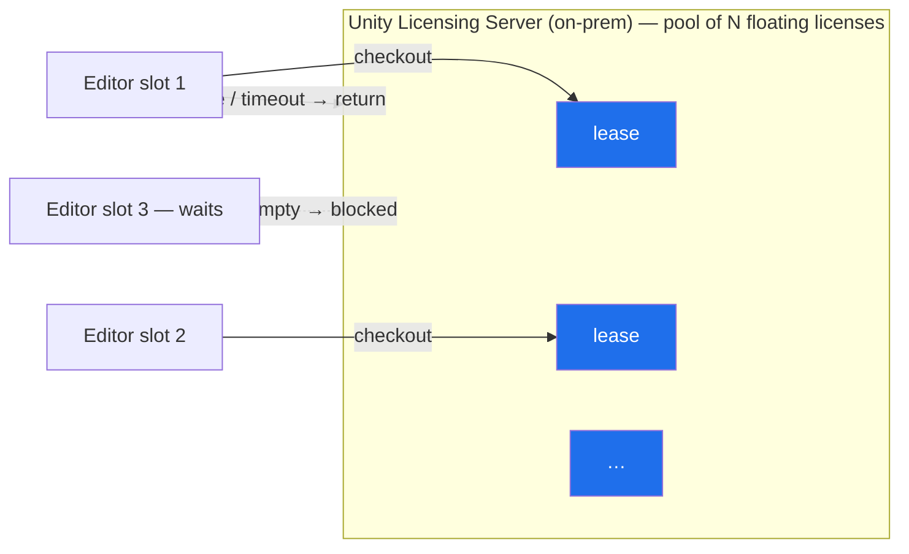
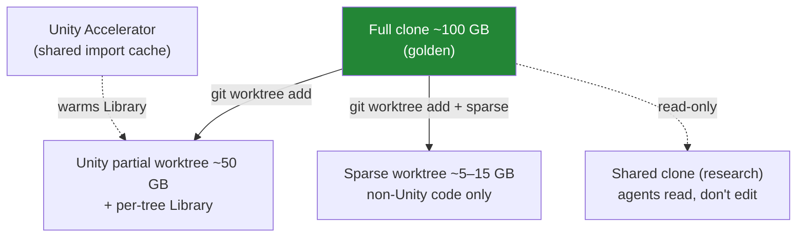
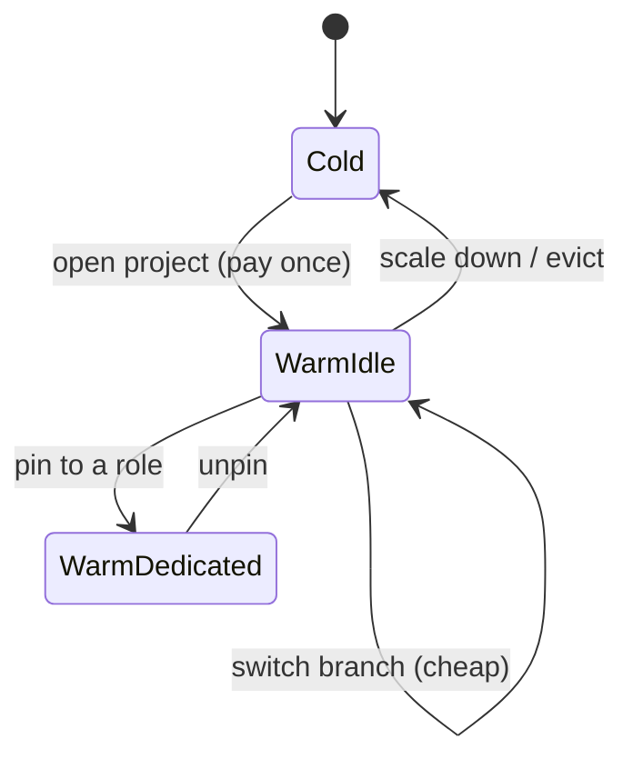
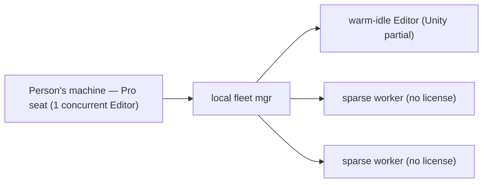
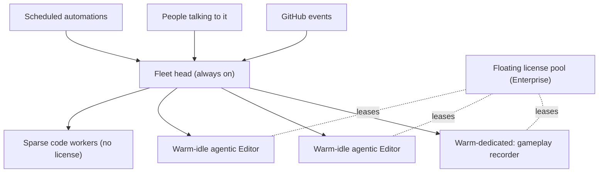
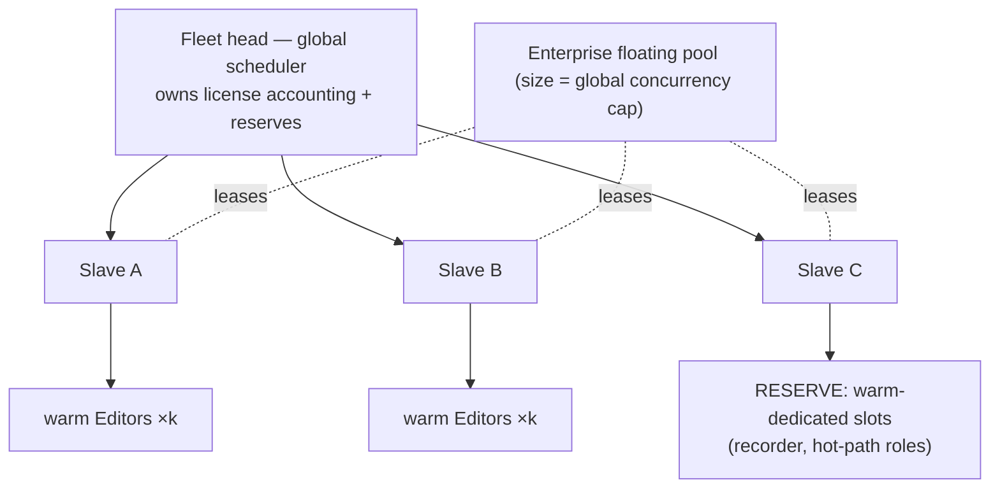

# Unity fleet manager — licensing, sizing, and deployment scales

- **Status:** Exploration / research note (2026-07-19). **Not** part of the locked
  L1→L12 rebuild. Captures how a fleet of Unity Editor instances can be run for
  **agentic work** (agents that *do stuff* — code, edit, record — not just build),
  the licensing/hardware limits that bound it, and the three deployment scales we grow
  through. Treat as a proposal until promoted to a PRD + ADRs.
- **Audience:** the owner + IT/ops, sizing a local box, a small always-on server fleet,
  and (later) a big fleet with reserves.
- **Numbers are placeholders.** Every figure tagged `⟨profile⟩` is a guess to be
  replaced by real profiling of our ~100 GB game. The *shapes* (which resource is
  scarce, how they trade off) are what to trust; the digits are not.

---

## 0. TL;DR — the one constraint that shapes everything

> **The Unity license is the scarce resource, not RAM or disk.** Interactive/agentic
> Unity work needs a *full seat*, and **one seat runs exactly one Editor at a time**.
> So the number of concurrent Unity Editors doing agent work is **hard-capped by the
> number of seats you own** (Pro) or the **size of your floating pool** (Enterprise).

Everything else — how much RAM a box needs, how big a worktree is, whether an Editor
is warm or cold — is secondary sizing *underneath* that cap. The fleet manager is, at
its core, **a scheduler for a small pool of concurrency-limited Unity licenses** spread
across many warm Editor slots and many worktrees.

Two corollaries that kill tempting shortcuts:

- **Build Server licenses do NOT help here.** They run Unity in `-batchmode` for
  **builds only** — they *cannot open the Editor or author content*. Great for a CI
  build farm, useless for "agent opens the project and codes/edits/records."
- **You can't cheat concurrency by moving a seat around.** A seat allows 2 activations
  (2 machines) *for one person's convenience*, but still **one running Editor at a
  time**. N concurrent agentic Editors ⇒ N seats (Pro) or an N-wide floating pool
  (Enterprise).

---

## 1. How Unity licensing works (2026)

### 1.1 The license types

| License | Model | Concurrency rule | Runs the interactive Editor? | Fits agentic fleet? |
|---|---|---|---|---|
| **Personal** | Free, named user | 1 Editor / user | Yes | ❌ revenue/eligibility caps; not for a studio |
| **Pro** (named seat) | Per-seat, signed in with a Unity ID | **1 Editor at a time per seat**; 2 activations (machines) per seat but not concurrent | Yes | ✅ but every concurrent Editor = 1 seat |
| **Pro + Build Server add-on** | Add-on packs of build licenses | Batchmode builds only | **No** — batchmode build only, cannot author | ⚠️ builds only (CI), not agentic work |
| **Enterprise** | Per-seat + **Floating licensing** option | Floating = **concurrency pool** served by a local Unity Licensing Server | Yes | ✅✅ the clean model for a shared, headless fleet |
| **Enterprise Build Server** | Build licenses scale with seat count | Batchmode builds only | No | ⚠️ builds only (CI) |

**Named-user (seat) licensing** — Personal/Pro — ties a license to a *person's* Unity
ID. Sign in → activated on that machine; to move to another machine you sign out here
and in there. One instance at a time, per seat.

**Floating licensing** — **Enterprise only** — is the concurrency model that actually
matches a fleet. You stand up a **Unity Licensing Server** on your network with a pool
of N floating licenses. When an Editor starts it **requests a lease** from the pool;
when it closes (or drops offline past a timeout) the license **returns to the pool
automatically**. It's checkout/checkin against a shared pool, not a per-person seat.

### 1.2 Why floating (Enterprise) is the right target for the autonomous fleet

A headless box spinning Editors for **agents** has no single "person" behind each
Editor — the named-user "for your convenience, single person" framing doesn't fit, and
stacking many named seats on one autonomous box is a compliance grey zone. **Floating
licensing is the sanctioned way to have one (or many) machines run several concurrent
Editors from a shared pool.** The fleet's concurrency then equals the pool size, which
is a clean number to schedule against.

> ⚠️ **Verify with Unity before committing.** Exact floating-pool sizing, on-prem
> Licensing Server terms, and whether an "agent" counts as a user for a seat are
> commercial/legal questions — get it in writing from Unity sales. This doc assumes the
> **Enterprise + floating** path for anything autonomous, and **per-seat Pro** for
> individuals on their own machines.

### 1.3 What this means for us

| Deployment | Sanctioned license path | Concurrency cap = |
|---|---|---|
| A person on their own machine (local fleet) | Their **Pro seat** | 1 Editor at a time (their seat) |
| Small always-on server fleet (autonomous agents) | **Enterprise floating pool** | pool size |
| Big fleet with reserves | **Enterprise floating pool**, larger | pool size |
| CI build farm (separate concern) | **Build Server** add-on | # build licenses |

---

## 2. Resource sizing per Editor instance ⟨all placeholders — profile⟩

Per **warm Editor of our ~100 GB game**. Replace every number after real profiling.

| Resource | Idle-warm (project loaded, no work) | Active (agent editing / playmode / import) | Notes |
|---|---|---|---|
| **RAM** | `⟨profile⟩ ~12 GB` | `⟨profile⟩ ~20 GB, spikes 24+` | Heavy-asset projects routinely 16–25 GB+; not linear with project size |
| **CPU** | ~idle, occasional import | 1–N cores on import/compile/playmode | Import & shader compile are the burst cost |
| **Disk (working tree)** | see §3 (worktree shape) | + transient build/import output | |
| **Disk (Library/import cache)** | `⟨profile⟩ ~30–60 GB` per worktree | grows with imports | **Per-worktree**, not shared — see §3 |
| **Cold-start cost** | — | `⟨profile⟩ 3–8 min` open→interactive (first import can be far worse) | This is *why* we keep Editors warm (§4) |

**Machine sizing** — reserve headroom for OS + the agent/CLI processes + import spikes
(`⟨profile⟩ ~16–24 GB`), then divide the rest by active-RAM-per-Editor:

| Box RAM | Reserve | Budget/Editor `⟨profile⟩` | **Warm Editors (approx)** |
|---|---|---|---|
| 64 GB | 16 GB | ~20 GB | `⟨profile⟩ ~2` |
| 128 GB | 24 GB | ~20 GB | `⟨profile⟩ ~5` |
| 256 GB | 24 GB | ~20 GB | `⟨profile⟩ ~11` |
| 512 GB | 32 GB | ~20 GB | `⟨profile⟩ ~24` |

> A box can *hold* more warm Editors than it has licenses to *run agentic work* in.
> That's fine and intended: warm-idle Editors parked on branches cost RAM but not a
> license lease until they're actively leased. The **license pool** (§1) and the **RAM
> budget** are two independent caps — the fleet manager respects both.

---

## 3. Worktree strategy — four clone shapes

The game is `⟨profile⟩ ~100 GB` on a full clone. We don't give every slot a full clone.
Git **worktrees** let one repo back many working trees; **sparse-checkout** narrows a
worktree to a subset of paths. The catch: **Unity's `Library/` import cache is
per-working-tree** and expensive to rebuild — **Unity Accelerator** (on-prem asset
cache) shares imported *artifacts* across machines/worktrees so a fresh Library
downloads cached imports instead of reimporting from scratch.

| Shape | Size `⟨profile⟩` | Contents | Unity Library? | Who / what for |
|---|---|---|---|---|
| **Full clone** | ~100 GB | Everything | Yes (full) | Golden reference; the source worktrees branch from |
| **Unity partial worktree** | ~50 GB | Unity project subset needed to open + work | Yes (per-tree, Accelerator-backed) | Agents doing **Unity work** (edit scenes/assets, playmode, record) |
| **Sparse worktree (non-Unity)** | `⟨profile⟩ ~5–15 GB` | Only the code/tooling paths, no big assets | No (never opens the Editor) | Agents touching **non-Unity code** — no license, no Library, cheap |
| **Shared read-only clone** | 1× ~100 GB, shared | Full tree, read-mostly | Optional | **Research / designers** asking an agent to *understand* something, not change it |

**Rules of thumb**

- **Non-Unity code work → sparse worktree, no Editor, no license.** Most "code and
  stuff" that isn't scene/asset authoring should never lease a Unity license.
- **Unity work → partial worktree + a leased Editor.** This is the expensive lane;
  it's what the license pool is *for*.
- **Research/understanding → shared read-only clone**, ideally no Editor at all.
- **Stand up Unity Accelerator early** — without it every new worktree pays full
  reimport, which dominates cold-start for a 100 GB game.

---

## 4. Instance lifecycle states — why we keep Editors warm

Opening a big Unity project is the dominant latency (`⟨profile⟩ 3–8 min+`). So the fleet
**keeps Editors open and re-points them at branches** instead of opening/closing.

| State | Holds RAM? | Holds a license lease? | Latency to useful work | Use |
|---|---|---|---|---|
| **Warm-dedicated** | Yes | Yes (pinned) | ~instant (already on task) | A role that must always be ready (§5) |
| **Warm-idle (pooled)** | Yes | Not until assigned | branch-switch only `⟨profile⟩ ~10–60 s` | The default worker — parked, ready, cheap to retask |
| **Cold** | No | No | full open + import | Scaled-down / overflow only |

**Key move:** a warm-idle Editor **switches to whatever branch a job needs** rather than
spawning a new Editor. Branch-switch (+ incremental reimport, Accelerator-backed) is
seconds-to-a-minute; a cold open is minutes. Keep the pool warm; pay the open cost once.

---

## 5. Fleet roles

A slot in the fleet has a **role** that fixes its worktree shape, whether it's pinned
warm, and whether it holds a license.

| Role | Warm? | License lease | Worktree | Example |
|---|---|---|---|---|
| **Dedicated task Editor** | Warm-dedicated (pinned) | Pinned | Unity partial | **Gameplay recorder** — always open; a record request just points it at a branch and rolls, no open/close |
| **Pooled agentic Editor** | Warm-idle → leased on demand | On assignment | Unity partial | General "agent does Unity work" worker; retasked by branch-switch |
| **Non-Unity code worker** | N/A (no Editor) | None | Sparse | Agent edits code/tooling, runs tests — never opens Unity |
| **Research/read node** | N/A or shared | None | Shared read-only | Designer asks an agent to explain a system |
| **Build node** | Cold/on-demand | **Build Server** (separate) | Full/partial | CI builds in batchmode — separate license class (§1) |
| **Head / orchestrator** | Always on | None (the fleet manager itself) | — | Schedules leases, warms the pool, provisions worktrees, routes work; on a big fleet it also drives the slaves |

---

## 6. The three deployment scales

We grow through three shapes. Same primitives (licenses, warm slots, worktrees, roles);
different size and ownership.

### 6.1 Local fleet — per person, on their own machine (today)

What the owner does now, generalized. Each person runs **their own** small fleet on
**their own Pro seat** — so the org doesn't need a central box just for individuals to
work. We give people the *tools* (fleet manager + worktree provisioning) to run a local
fleet; they supply the seat and the machine.

- **License cap:** their 1 Pro seat ⇒ **1 concurrent Unity Editor**. Everything else on
  that box must be **non-Unity (sparse, no-license)** work, or it queues for the seat.
- **Sizing:** whatever their workstation has — see §2 table.
- **Point:** most of an individual's parallel agent sessions are code/tooling, which
  don't need Unity at all; the single seat gates only the genuine Unity-work lane.

### 6.2 Server fleet — small, always-on, autonomous (the near-term build)

At least one **small central fleet with a Unity license** so **agents can run Unity
automations remotely** with no human at the keyboard: react to GitHub events, respond to
people talking to it, run scheduled automations (record gameplay, run playmode checks).

- **License:** **Enterprise floating pool** sized to the number of concurrent Editors
  this box should run (`⟨profile⟩ e.g. 3–4`). A local Unity Licensing Server holds the
  pool; the recorder pins one lease, the rest float.
- **Sizing (placeholder):** one `⟨profile⟩ 128–256 GB` box → `⟨profile⟩ ~4–8` warm
  Editors held in RAM, of which the floating pool lets `⟨profile⟩ 3–4` do agentic work
  at once; sparse workers scale with cores, not licenses.
- **Always-warm:** Editors stay open; jobs arrive as **branch assignments** to warm
  slots. The recorder never closes.

### 6.3 Big fleet with reserves — head + slaves (the scale-out)

One box stops being enough at `⟨profile⟩ ~10–15 people × 2–5 sessions each`. The head
becomes a **scheduler over a set of slave machines**, each running its own local pool of
warm Editors, all leasing from a shared floating pool. **Reserves** = warm-dedicated
slots kept ready for latency-critical roles so a request never waits on a cold open.

- **License:** floating pool sized to **total desired concurrent Editors across all
  slaves** — this is the single global cap the head schedules against.
- **Reserves:** a fraction of the pool (`⟨profile⟩ ~10–20 %`) is pinned to warm-dedicated
  role slots so hot-path requests are instant; the rest floats for on-demand agentic
  work.
- **Scale unit:** add a slave = + its RAM's worth of warm slots, but **concurrency only
  rises if the floating pool also grows**. Licenses, not machines, are the ceiling.

| Scale | License model | Concurrency cap | Machines | Who owns it |
|---|---|---|---|---|
| **Local** | Pro seat (per person) | 1 Editor | 1 (theirs) | The individual |
| **Server** | Enterprise floating (small pool) | pool `⟨profile⟩ ~3–4` | 1 always-on | Us / ops |
| **Big + reserves** | Enterprise floating (large pool) | pool `⟨profile⟩ ~10–30` | head + N slaves | Ops |

---

## 7. What the fleet manager software must do

Derived from the above; the head's responsibilities.

1. **License accounting — the scheduler's scarce resource.** Track the floating pool:
   leases out, free, queued. Never dispatch Unity work with no lease available; queue it.
2. **Warm-pool management.** Keep target N Editors warm; open on scale-up, evict to cold
   on scale-down; honor pinned (dedicated/reserve) slots.
3. **Worktree provisioning.** Create the right **shape** per job (§3): sparse for
   non-Unity, Unity partial for Editor work, read-only for research; wire Accelerator so
   fresh Libraries warm from cache.
4. **Branch assignment to warm slots.** Prefer *retasking a warm-idle Editor by
   branch-switch* over a cold open.
5. **Roles & reservations.** Pin dedicated slots (recorder, hot-path); hold reserves.
6. **Scale-out.** On a big fleet, place work across slaves under the **global** license
   and RAM caps.
7. **Route inbound triggers.** GitHub events, chat, schedules → jobs → slots.

---

## 8. Worked capacity example ⟨all placeholders⟩

Illustrative only — **do not quote these until profiled.** Small server fleet:

| Input | Value `⟨profile⟩` |
|---|---|
| Box RAM | 256 GB |
| Reserve (OS + agents + spikes) | 24 GB |
| Active RAM / warm Editor | 20 GB |
| ⇒ Warm Editors the box can hold | ~11 |
| Floating pool (Enterprise) | 4 |
| ⇒ Concurrent **agentic** Editors | 4 (license-capped, not RAM-capped) |
| Of which pinned reserve (recorder) | 1 |
| ⇒ Floating agentic slots | 3 |
| Sparse (non-Unity) workers | ~cores-bound, no license |

Read: **RAM lets the box park ~11 warm Editors, but only 4 can do Unity work at once
because the pool is 4** — grow concurrency by buying pool, not RAM. This is the shape to
re-derive with real numbers.

---

## 9. Open questions / what to profile

- **RAM per warm Editor** (idle vs active vs import spike) for our actual ~100 GB game.
- **Cold-open and branch-switch times**, with and without Unity Accelerator.
- **Library size** per Unity partial worktree; Accelerator hit-rate.
- **Worktree sizes**: real full / partial / sparse footprints.
- **Floating pool sizing & terms** — confirm Enterprise floating fits an *autonomous
  agent* fleet, and the on-prem Licensing Server commercials, **in writing from Unity**.
- **Where Build Server fits** for the CI build lane (separate from this fleet).

---

## Sources

- [Unity — Licensing overview (Manual)](https://docs.unity3d.com/Manual/LicenseOverview.html)
- [Unity — Licensing documentation](https://docs.unity.com/licensing/en-us/manual)
- [Unity Licensing Server](https://docs.unity.com/en-us/licensing-server)
- [Unity Editor Software Terms](https://unity.com/legal/editor-terms-of-service/software)
- [Unity Support — one Editor instance at a time per seat / activations](https://support.unity.com/hc/en-us/articles/4402049280276-I-would-like-to-have-more-than-two-activations-on-my-license-What-can-I-do)
- [Unity Support — "Exceeded seat limit"](https://support.unity.com/hc/en-us/articles/28211576438804-I-am-getting-an-Exceeded-seat-limit-error-message)
- [Unity Support — Build Server license cannot open the Editor (batchmode/build only)](https://support.unity.com/hc/en-us/articles/4401984205204-Why-am-I-not-able-to-open-the-Unity-Editor-with-a-Build-Server-license)
- [Unity Blog — Offload project builds with Unity Build Server](https://unity.com/blog/games/offload-project-builds-with-unity-build-server)
- [Unity — Cache Server / Accelerator (asset import cache)](https://docs.unity3d.com/2020.1/Documentation/Manual/CacheServer.html)
- [Unity — The Asset Database (Library folder contents)](https://docs.unity3d.com/6000.0/Documentation/Manual/asset-database-contents.html)
