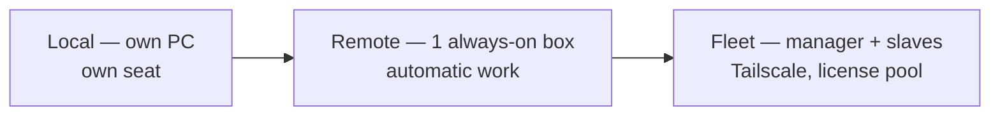

# Unity Fleet — parallel Unity sessions for agentic work

> **Status:** Design note (2026-07). Exploration — **not** part of the locked L1→L12
> rebuild. **Audience:** IT + ops (license path, hardware, procurement) and the team
> (the local → remote → fleet roadmap).
> **Numbers are placeholders:** `⟨profile⟩` = measure on the real game · `⟨verify⟩` =
> confirm with Unity before relying on it.

---

## 0 · Context — why this exists

```
Automation / AI   →   parallel Unity sessions   →   Fleet
```

Four beats:

1. **Work gets done fast.** Agents do real work — code, edits, validation — without a human driving each step.
2. **More work happens at once.** One person runs several sessions in parallel; several people do the same.
3. **That work needs Unity.** You can't validate Unity work without a running Unity — so parallelism means *many live editors*.
4. **Many editors → a fleet.** Past a handful of sessions one machine can't hold them, so something has to place, warm, and license them across machines. That's the fleet.

This doc covers the **limitations** that bound it, the **use cases** it unlocks, and the **how** — local, remote, and a full fleet.

---

## 1 · Limitations — the walls

| Wall | The constraint |
|---|---|
| **License** | See below — floating licensing is **per machine**, not per editor. |
| **Disk** | ~75 GB per project clone `⟨profile⟩`. Five unshared clones ≈ 375 GB before any sharing. |
| **RAM** | An okay machine tops out around **~5 live sessions** `⟨profile⟩`. |
| **Worktrees** | Unity handles git worktrees badly (the per-tree `Library` import cache). The copy strategies in §3 work around it — none for free. |
| **No VM trick** | Floating leases bind to a **machine identity**, so you can't split one host into per-session VMs to multiply licenses — identities drift (leases orphan) or collide (VMs seen as one machine). Plan on **physical machines**. `⟨verify⟩` |

### How Unity licensing actually works

Two models, and only one fits a fleet:

| Model | Rule | Fits a fleet? |
|---|---|---|
| **Named-user seat** (Pro) | One editor at a time, per seat. The **individual/local** path. | For people on their own PC |
| **Floating** (Enterprise + on-prem **Licensing Server**) | **One lease per machine** — the first editor on a machine grabs a lease from the pool; the **last** editor closing returns it. Every editor on that machine **shares** it. | ✅ the shared-fleet path |

> **The key correction.** A floating license caps **how many machines** run Unity at
> once — **not how many editors**. Within a machine the ceiling is **RAM/disk (~5
> sessions `⟨profile⟩`)**, not license. `⟨verify commercial⟩` confirm the terms permit N
> shared instances per machine.

*(A **Build Server** license is a separate thing — `-batchmode` **builds only**, can't open the editor or validate content. Useful for a CI build lane, not for agentic work.)*

### The wall that forces a fleet

```
~5 sessions / dev  ×  5 devs  =  25 concurrent sessions
25 sessions  ÷  ~5 per machine  =  ~5 machines  =  ~5 floating licenses   ⟨profile⟩
```

No single box does 25. So either everyone self-hosts locally (no shared licenses), or we run a fleet of machines — which is where §3 goes.

---

## 2 · Use cases — what it unlocks

| Use case | What it buys |
|---|---|
| **Parallel sessions** | Many tasks progress at once instead of one-at-a-time |
| **Automatic validation** | An agent opens Unity, checks its own work, iterates — no human gate |
| **Automatic PR / git** | React to GitHub, open/update PRs, answer review comments |
| **Recording gameplay** | Batch recordings of specific parts, queued to a recorder |
| **Delegated work** | "Ask an agent to do X" and it runs end-to-end |
| **Remote sessions** | Drive a live session from anywhere — even from your phone |
| **Shared session** | Designers / QA browse or ask against one live instance |

---

## 3 · How — running it

### Where it runs — three stages

| Stage | Shape | License need |
|---|---|---|
| **Local** | Everyone runs their own sessions on their own PC | Their own seat — **no shared cost** |
| **Remote** | One always-on machine for automatic / remote work | Its own lease(s) |
| **Fleet** | A manager + slave PCs, self-hosted over **Tailscale** (no extra hosting cost) | A pool sized to **machines**, not editors |



### Machine types / roles

- **Dedicated role machines** — e.g. the always-on **recorder**; non-urgent jobs **queue** to it (ten recordings → one recorder queue, not ten boxes).
- **Warm vs. not-warm** — kept open (instant) vs. cold (pay the minutes-long open cost). Warm-idle editors **switch branches** instead of reopening.
- **Headless vs. headed** — headless is cheaper/faster for **compile + validate + build**; headed only when you need visuals (recording, designer review).

### Copies of the project

| Shape | Trade |
|---|---|
| **Full clone** (~75 GB) | Everything; simplest, heaviest |
| **Worktree, shared `Library`** | Share the import cache, duplicate the rest — saves the reimport cost |
| **Sparse worktree** (C#-only) | No editor, no `Library`, cheap — but **hard to carve out** cleanly in practice |

*(Unity **Accelerator** — an on-prem asset cache — lets fresh trees warm their `Library` from shared imports instead of full reimport.)*

### How the fleet manager works

The manager keeps a **machine inventory**, tracks each machine's **warm/cold** state and **free leases**, and **places** each job on a suitable machine — scriptable. Its job is marshalling **machines**, not rationing editors.

- License accounting — leases free / in use, per machine
- Warm-pool — keep N machines/editors warm; retask by branch-switch
- Copy provisioning — pick the right clone shape per job
- Roles & reservations — pin dedicated machines (recorder), hold reserves
- Scale-out — place work across slaves under the machine/RAM caps

### 3.x · Container sandboxing *(speculative — grey area)*

> ⚠️ **Not settled.** Needs technical validation, more research, and a **legal/terms
> check** with Unity before anything relies on it. A direction, not a plan.

**The idea.** One licensed machine (a stable host/VM with Unity properly installed +
licensed). Run **containers** on it that mount a **shared path** holding the heavy
**assets + the license**, so every container **reuses the same assets and the same
lease**. Isolation is the main win — beyond sandboxing it buys little (same machine,
same license, same assets).

```
   licensed host / VM  ── one lease, assets on a shared mount
        ├── container A ─┐
        ├── container B ─┤  each: own local changes over the mount
        └── container C ─┘  C# validated *inside* the container
                    │
                    ▼  promote only approved changes
             main Unity instance ── real compile + playmode test
```

**The interesting part — a "poor-man's worktree."** Each container carries its **own
local changes** over the shared mount and **validates the C# in-container** (compile /
tests — cheap, headless). On pass, it **signals the main Unity instance** to do the real
Unity compile + test. The goal is to **control exactly which changes promote** from a
container to the main instance — worktree-like isolation **without**:

- **duplicating everything** (~75 GB per container), and
- **mixing multiple containers' work** in one editor instance.

**To validate before trusting it:** whether the license client works across the
mount/container boundary; how much a C#-only in-container pass catches vs. a full Unity
compile; the promote/merge mechanism; and how many containers' work **serializes** into
the single main instance without collisions.

---

## Open questions / what to profile

- **RAM per session** (idle vs. active vs. import spike) on the real game → the real per-machine cap.
- **Cold-open vs. branch-switch** time, with/without Accelerator.
- **Copy footprints** — full / shared-`Library` worktree / sparse — and Accelerator hit-rate.
- `⟨verify⟩` **Floating terms** — N shared instances per machine; VM/container stance (`floatinglicense-support@unity3d.com`).
- **Container spike** — does the license client work across a mount; C#-only validation fidelity; the promote mechanism.

## Sources

- [Unity — Licensing overview (per-machine floating allocation)](https://docs.unity3d.com/Manual/LicenseOverview.html)
- [Unity — Licensing Server / floating setup](https://docs.unity3d.com/licensing/manual/)
- [Unity — Editor Software Terms (one instance per seat, named-user)](https://unity.com/legal/editor-terms-of-service/software)
- [Unity Support — Build Server is batchmode/build-only](https://support.unity.com/hc/en-us/articles/4401984205204-Why-am-I-not-able-to-open-the-Unity-Editor-with-a-Build-Server-license)
- [Unity — Accelerator / asset cache](https://docs.unity3d.com/2020.1/Documentation/Manual/CacheServer.html)
